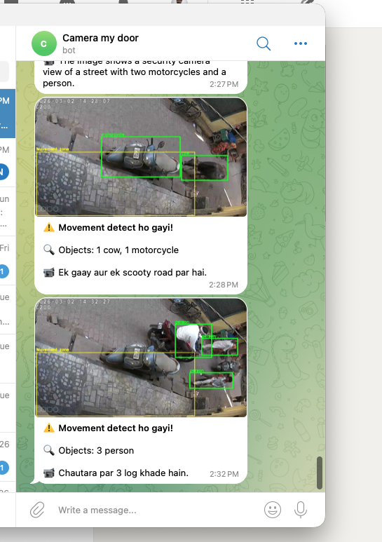

# VisionGuard – AI-Powered Camera Monitoring

**VisionGuard** turns any RTSP camera (Tapo, Reolink, Hikvision, and more) into a smart security system. It uses **Cloudflare Workers AI** (Llama Vision) to describe what it sees, detects movement in specific zones, and sends rich alerts to your Telegram—with images and AI-generated descriptions.

Perfect for: driveway monitoring, doorbell alerts, pet watching, or any area you want to keep an eye on.



---

## What You Get

- **Live monitoring** – Movement detection with instant Telegram alerts (image + AI description)
- **Zone-based alerts** – Monitor only a specific area (e.g., driveway, door) instead of the whole frame
- **AI vision** – Llama 3.2 Vision describes detected objects (people, cars, pets) in natural language
- **Background service** – Runs 24/7 on your Mac or Windows, even when you close the terminal
- **Rich notifications** – Photos, object/face bounding boxes, license plate OCR, loud sound clips
- **Chat with your camera** – Ask "What do you see?" or "Who's at the door?" via Telegram

---

## Quick Start (5 Steps)

### Step 1: Prerequisites

- **Python 3.10+** – [python.org](https://www.python.org/downloads/)
- **FFmpeg** – For RTSP streams ([install guide](https://ffmpeg.org/download.html))
- **Cloudflare account** – Free tier works
- **Telegram** – For alerts
- **RTSP camera** – Tapo, Reolink, or any camera that supports RTSP

### Step 2: Clone & Install

```bash
git clone https://github.com/njaiswal78/visiongaurd.git
cd visiongaurd
pip install -r requirements.txt
```

### Step 3: Enable RTSP on Your Camera

**Tapo cameras (C310, C320, etc.):**

1. Open **Tapo app** → select your camera → **Device Settings** (gear icon)
2. Go to **Advanced Settings** → **Camera Account**
3. Create a username and password (6–32 chars) – *different from your Tapo account*
4. Note your camera’s **IP address**: Device Settings → **Device Info**
5. RTSP URL format: `rtsp://YOUR_CAMERA_IP:554/stream1` (high quality) or `stream2` (low)

**Other cameras:** Check your brand’s docs for RTSP/ONVIF. Common format: `rtsp://IP:554/stream1`

### Step 4: Configure Credentials

```bash
cp .env.example .env
```

Edit `.env` with your values:

```env
# Cloudflare (required)
CLOUDFLARE_ACCOUNT_ID=your_account_id
CLOUDFLARE_AUTH_TOKEN=your_api_token

# Camera
RTSP_URL=rtsp://192.168.1.100:554/stream1
RTSP_USERNAME=your_camera_username
RTSP_PASSWORD=your_camera_password

# Telegram (required for alerts)
TELEGRAM_BOT_TOKEN=your_bot_token
TELEGRAM_USERNAME=your_telegram_username
```

**Get Cloudflare credentials:**

1. [Sign up](https://dash.cloudflare.com/sign-up) or log in
2. **Account ID**: Workers & Pages → Overview (right sidebar)
3. **API Token**: My Profile → API Tokens → Create Token → "Edit Cloudflare Workers" + Workers AI:Edit

**Get Telegram bot token:**

1. Message [@BotFather](https://t.me/BotFather) on Telegram
2. Send `/newbot` and follow the prompts
3. Copy the token into `TELEGRAM_BOT_TOKEN`
4. Add `TELEGRAM_USERNAME` (your Telegram handle) to restrict the bot to you

### Step 5: Agree to Meta License (one-time)

```bash
python camera_vision.py --agree
```

---

## Run the Telegram Bot

Start monitoring and get alerts on Telegram:

```bash
python telegram_bot.py
```

- **Movement detected** → You get an image + AI description on Telegram
- Ask *"What do you see?"* or send `/photo` for a live snapshot
- Send `/detect` for objects and faces with bounding boxes
- Send `/history` to ask about past activity

---

## Monitor a Specific Area (ROI)

By default, movement is tracked across the whole frame. To watch only a zone (e.g., driveway, door):

```bash
python setup_roi.py
```

1. A live frame opens
2. **Click and drag** to draw a rectangle around the area to monitor
3. Press **S** to save
4. Alerts will only trigger when movement is detected inside that zone

The zone appears in yellow on `/detect`, `/photo`, and alert images.

---

## Deploy as Background Service

Keep VisionGuard running 24/7, even when you close the terminal.

### macOS (LaunchAgent)

```bash
./install-service.sh
```

- Starts now and on every login
- Restarts automatically if it crashes
- Logs: `logs/telegram-bot.log`

**Commands:**

| Action | Command |
|--------|---------|
| Stop | `launchctl unload ~/Library/LaunchAgents/com.rtsp-ai-vision.telegram-bot.plist` |
| Start | `launchctl load ~/Library/LaunchAgents/com.rtsp-ai-vision.telegram-bot.plist` |
| Logs | `tail -f logs/telegram-bot.log` |
| Uninstall | `./uninstall-service.sh` |

### Windows (Task Scheduler)

```powershell
.\install-service.ps1
```

Or run manually:

1. Open **Task Scheduler** (search in Start menu)
2. Create Basic Task → Name: "VisionGuard"
3. Trigger: **When the computer starts**
4. Action: **Start a program**
   - Program: `C:\Path\To\Python\python.exe`
   - Arguments: `C:\Path\To\rtsp-ai-vision\run_telegram_bot.py`
   - Start in: `C:\Path\To\rtsp-ai-vision`
5. Check **Run whether user is logged on or not** (optional)
6. Finish

---

## Telegram Commands

| Command | Description |
|---------|-------------|
| *"What do you see?"* | Live image + AI description |
| `/photo` or `/frame` | Quick snapshot |
| `/detect` | Objects & faces with bounding boxes |
| `/who` | Who's at the door (needs `known_faces/*.jpg`) |
| `/history` | Ask about past observations |
| *"What did you see in the last hour?"* | Historical Q&A |

---

## Tuning Movement Sensitivity

In `.env`:

| Variable | Default | Description |
|----------|---------|--------------|
| `MOVEMENT_CHECK_SECONDS` | 2 | How often to check for movement |
| `ALERT_COOLDOWN_SECONDS` | 10 | Min gap between alerts |
| `MOVEMENT_THRESHOLD` | 8 | Lower = more sensitive (6–10 for small movements) |
| `MOVEMENT_DIFF_PIXEL` | 15 | Lower = picks up smaller changes (10–15) |

---

## Object & Face Detection

- **Object detection** – YOLOv8 (local, free) or Cloudflare DETR. Set `USE_YOLO=1` in `.env` for local.
- **Face detection** – OpenCV (local)
- **Visitor ID** – Add photos to `known_faces/` (e.g. `john.jpg`) + `pip install face_recognition`
- **License plates** – OCR via EasyOCR when cars/motorcycles detected

---

## Sound Alerts (Optional)

If your camera has audio, VisionGuard can detect loud sounds (cry, scream) and send a short clip:

- Requires FFmpeg with libopus
- Disable with `--no-sound` if your camera has no audio

---

## Requirements

- Python 3.10+
- FFmpeg
- Cloudflare account (Workers AI)
- RTSP camera on same network

---

## Troubleshooting

| Issue | Fix |
|-------|-----|
| "Could not capture frame" | Check `RTSP_URL`, username, password; ensure camera is reachable |
| API errors | Verify `CLOUDFLARE_ACCOUNT_ID` and `CLOUDFLARE_AUTH_TOKEN` |
| License error | Run `python camera_vision.py --agree` |
| No Telegram alerts | Check `TELEGRAM_BOT_TOKEN`; start a chat with your bot first |

---

## License

MIT
